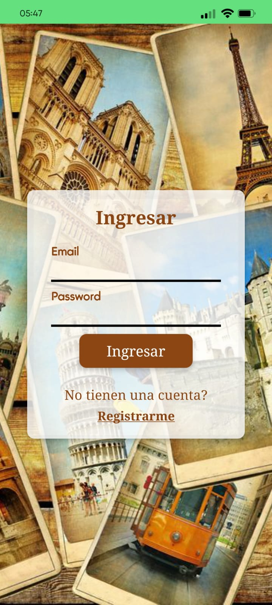
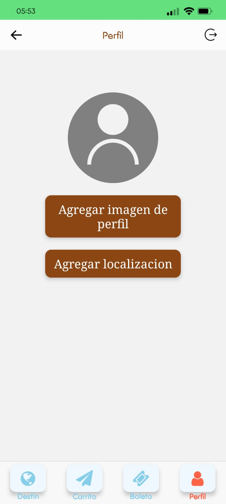
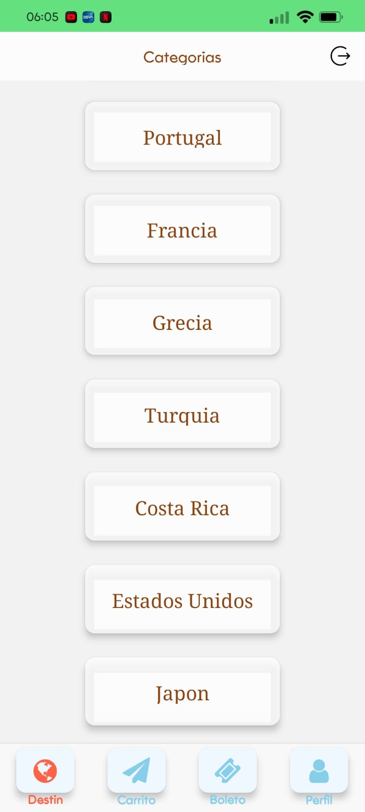
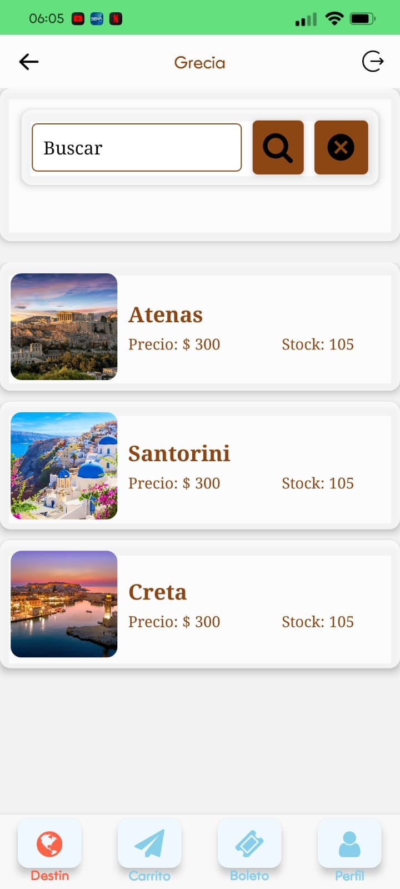
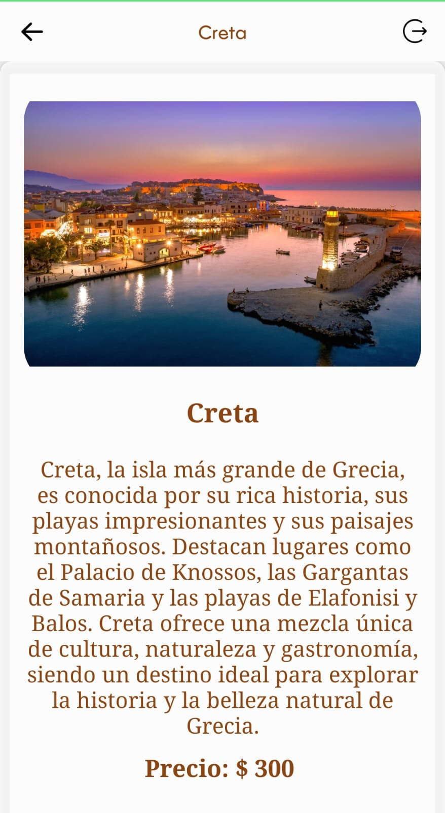
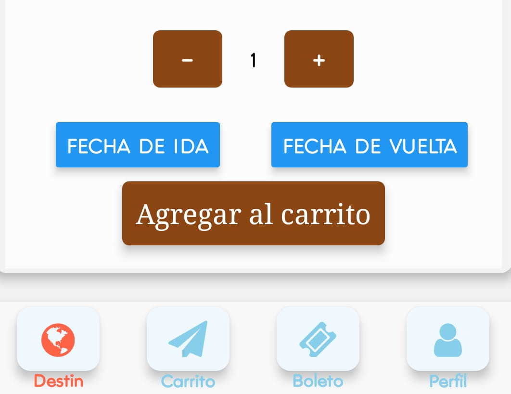

# E-Commerce App - React Native 
`Una aplicación de comercio de boletos de viaje desarrollada con React Native, que ofrece una experiencia de compra completa y fácil de usar.`
## Funcionalidades Principales
### Pantalla de Cuenta
* Acceso Seguro: Solo los usuarios autenticados pueden acceder a la pantalla de perfil y realizar compras.
* nformación del Usuario: Muestra detalles del usuario, como nombre y dirección. 





### Autenticacion con Firebase
- Utiliza el sistema de autenticación de Firebase para gestionar el acceso de los usuarios.
- Permite a los usuarios iniciar sesión y registrarse de manera segura.

### Pantalla de Categorias 
- Muestra una selección de categorías en tarjetas.
- Al hacer clic en una categoría, navega a la pantalla de productos correspondiente.



### Pantalla de Productos 
- Lista todos los productos en tarjetas con nombre y foto.
- Incluye un buscador para filtrar productos por nombre.
- Al hacer clic en un producto, navega a la pantalla de detalles del producto.


### Pantalla de detalles del Producto

- Proporciona una descripción detallada del producto.
- Muestra el precio y permite seleccionar fechas en un calendario.
- Ofrece la opción de agregar al carrito.





### Navegacion Inferior 

```JavaScript
const TabNavigator = () => {
  return (
    <Tab.Navigator
      screenOptions={{
        headerShown: false,
        tabBarShowLabel: false,
        tabBarStyle: styles.tabBar,
        tabBarLabelPosition: "beside-icon",
      }}
    >
      <Tab.Screen
        name="ShopStack"
        component={ShopStack}
        options={{
          tabBarIcon: ({ focused }) => (
            <TabBarIcon text="Destinos" icon="globe" focused={focused} />
          ),
        }}
      />
      <Tab.Screen
        name="CartStack"
        component={CartStack}
        options={{
          tabBarIcon: ({ focused }) => (
            <TabBarIcon text="Carrito" icon="paper-plane" focused={focused} />
          ),
        }}
      />
      <Tab.Screen
        name="OrdersStack"
        component={OrdersStack}
        options={{
          tabBarIcon: ({ focused }) => (
            <TabBarIcon text="Boletos" icon="ticket" focused={focused} />
          ),
        }}
      />
      <Tab.Screen
        name="MyProfileStack"
        component={MyProfileStack}
        options={{
          tabBarIcon: ({ focused }) => (
            <TabBarIcon text="Perfil" icon="user" focused={focused} />
          ),
        }}
      />
    </Tab.Navigator>
  );
  ```

## Tecnogias Utilizadas
- **Firebase Authentication:** Proporciona un sistema de autenticación seguro para el acceso de los usuarios.
- **React Native Navigation Stack:** 
Maneja la transición entre diferentes pantallas dentro de la aplicación.
- **React Native Bottom Tab Navigation:** 
Facilita la navegación entre secciones mediante una barra de pestañas inferior.
- **Expo-Location:**Permite obtener y administrar la ubicación del usuario en tiempo real.
- **Expo-Picker-Image:**Ofrece una forma sencilla de seleccionar e importar imágenes para el perfil del usuario.
- **Redux:** Optimiza la gestión del estado global de la aplicación, asegurando una mejor organización de los datos.
- **RTK Query y Firebase:**Permiten realizar consultas y modificaciones en la base de datos de manera eficiente.

## Instalacion 
1. Clona el repositorio: `git clone https://github.com/tu-usuario/tu-aplicacion.git`
2. Instala las dependencias: `npm install`
3. Configura las claves de API para servicios externos (Expo-Location, Firebase, etc.).
4. Configura las credenciales de Firebase en tu proyecto.
5. Ejecuta la aplicación: `npm start`